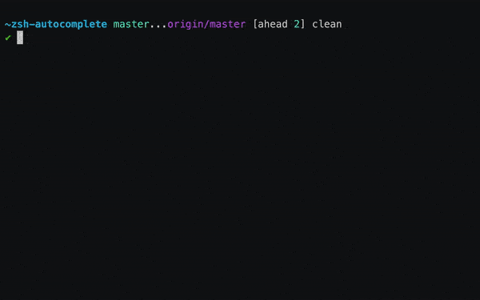
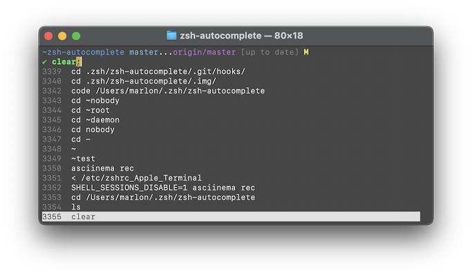
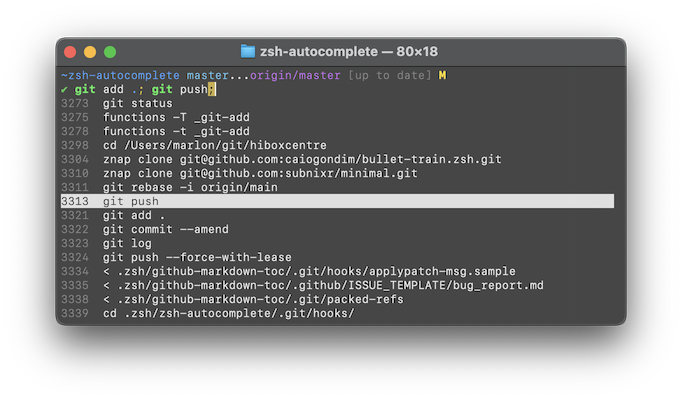

# Autocomplete for Zsh
Autocomplete for Zsh adds **real-time type-ahead autocompletion** to Zsh.  Find
as you type, then press <kbd>Tab</kbd> to insert the top completion or
<kbd>↓</kbd>to select another completion.

> Enjoy using this software?
[Become a sponsor!](https://github.com/sponsors/marlonrichert) 💝

[](https://asciinema.org/a/377611)

<sub>(The look and feel shown in images here might not be up to date.</sub>

## Other Features
Besides autocompletion, Autocomplete comes with many other useful completion
features.

### Optimized completion config
Zsh's completion system is powerful, but hard to configure.  So, let
Autocomplete [do it for you](Functions/Init/.autocomplete__config), while providing a
manageable list of [configuration settings](#configuration) for changing the
defaults.

### Fuzzy multi-line history search
Press <kbd>Ctrl</kbd><kbd>R</kbd> to do a real-time history search listing
multiple results.

[](https://asciinema.org/a/379844)

### History menu
Press <kbd>↑</kbd> to open a menu with the last 16 history items.  If the
command line is not empty, then the contents of the command line are used to
perform a fuzzy history search.



### Multi-selection
Press <kbd>Ctrl</kbd><kbd>Space</kbd> in the completion menu or the history menu
to insert more than one item.



### Recent dirs completion
Works out of the box with zero configuration, but also lets you
[use your favorite tool for tracking directories](#use-a-custom-backend-for-recent-directories)
instead.


## Key Bindings
* Depending on your terminal, not all keybindings might be available to you.
* Instead of <kbd>Alt</kbd>, your terminal might require you to press
  <kbd>Escape</kbd>, <kbd>Option</kbd> or <kbd>Meta</kbd>.
* In most terminals, <kbd>Enter</kbd> is interchangeable with <kbd>Return</kbd>,
  but in some terminals, it is not.

### On the command line
| `main` | `emacs` | `vicmd` | `viins` | Action
| -----: | ------: | ------: | ------: | -----:
| | <kbd>Tab</kbd> | | <kbd>Tab</kbd> | Insert top completion
| <kbd>Shift</kbd><kbd>Tab</kbd> | | | | Insert substring occurring in all listed completions
| <kbd>↑</kbd> | <kbd>Ctrl</kbd><kbd>P</kbd> | <kbd>K</kbd> | |  Cursor up _-or-_ [History menu](#history-menu)
| <kbd>↓</kbd> | <kbd>Ctrl</kbd><kbd>N</kbd> | <kbd>J</kbd> | | Cursor down _-or-_ Completion menu
| <kbd>Alt</kbd><kbd>↑</kbd> | <kbd>Alt</kbd><kbd>P</kbd> | <kbd>Shift</kbd><kbd>N</kbd> | | History menu (always)
| <kbd>Alt</kbd><kbd>↓</kbd> | <kbd>Alt</kbd><kbd>N</kbd> | <kbd>N</kbd> | | Completion menu (always)
| | <kbd>Ctrl</kbd><kbd>S</kbd> | <kbd>?</kbd> | | Search through _all_ menu text
| | <kbd>Ctrl</kbd><kbd>R</kbd> | <kbd>/</kbd> | | Toggle [history search mode](#real-time-history-search) on/off

### In the menus
| Key(s) | Action |
| -----: | ------
| <kbd>↑</kbd> <kbd>↓</kbd> <kbd>←</kbd> <kbd>→</kbd> | Change selection
| <kbd>Alt</kbd><kbd>↑</kbd> | Backward one group (completion only)
| <kbd>Alt</kbd><kbd>↓</kbd> | Forward one group (completion only)
| <kbd>PgUp</kbd><br><kbd>Alt</kbd><kbd>V</kbd> | Page up
| <kbd>PgDn</kbd><br><kbd>Ctrl</kbd><kbd>V</kbd> | Page down
| <kbd>Ctrl</kbd><kbd>S</kbd> | Enter search mode _-or-_ Go to next match
| <kbd>Ctrl</kbd><kbd>R</kbd> | Enter search mode _-or-_ Go to previous match
| <kbd>Tab</kbd><br><kbd>Enter</kbd> | Exit search mode _-or-_ Exit menu
| <kbd>Ctrl</kbd><kbd>Space</kbd> | Add another completion
| <kbd>Ctrl</kbd><kbd>-</kbd><br><kbd>Ctrl</kbd><kbd>/</kbd> | Remove last completion
| <kbd>Ctrl</kbd><kbd>G</kbd> | Remove all completions
| Other keys | Depends on the keymap from which you opened the menu. See the Zsh manual on [menu selection](https://zsh.sourceforge.io/Doc/Release/Zsh-Modules.html#Menu-selection).

## Requirements
Recommended:
* Tested to work with [Zsh](http://zsh.sourceforge.net) 5.8 and newer.

Minimum:
* Should theoretically work with Zsh 5.4, but I'm unable to test that.

## Installing & Updating
If you use [Znap](https://github.com/marlonrichert/zsh-snap), simply add the
following to your `.zshrc` file:
```zsh
znap source marlonrichert/zsh-autocomplete
```
Then restart your shell.

To update, do
```zsh
% znap pull
```

To uninstall, remove `znap source marlonrichert/zsh-autocomplete` from your
`.zshrc` file, then run
```zsh
% znap uninstall
```

### Manual installation
 1. Clone the repo:
    ```zsh
    % cd ~/Repos  # ...or wherever you keep your Git repos/Zsh plugins
    % git clone --depth 1 -- https://github.com/marlonrichert/zsh-autocomplete.git
    ```
 1.  Add at or near the top of your `.zshrc` file (_before_ any calls to
    `compdef`):
    ```zsh
    source ~/Repos/zsh-autocomplete/zsh-autocomplete.plugin.zsh
    ```
 1. Remove any calls to `compinit` from your `.zshrc` file.
 1. Restart your shell.

To update, do:
```zsh
% git -C ~autocomplete pull
```

To uninstall, simply undo the installation steps above in reverse order:
 1. Restore the lines you deleted in step 3.
 1. Delete the line you added in step 2.
 1. Delete the repo you created in step 1.
 1. Restart your shell.

### Other frameworks/plugin managers
To install with another Zsh framework or plugin manager, please refer to your
framework's/plugin manager's documentation for instructions.  When in doubt,
install [manually](#manually).

### Additional step for Ubuntu
If you're using Ubuntu, you additionally need to add the following to your
`.zshenv` file:
```zsh
skip_global_compinit=1
```

### Note for NixOS
Both the NixOS and the Home Manager modules for Zsh enable completion by 
default. The option is named the same thing in both: 
`programs.zsh.enableCompletion`. Make sure that you explicitly disable this
in whichever module you're using - possibly both.

## Troubleshooting
Try the steps in the
[bug report template](.github/ISSUE_TEMPLATE/bug-report.md).

## Configuration
The following are the most commonly requested ways to configure Autocomplete's
behavior.  Add these to your `.zshrc` file to use them.

### Pass arguments to `compinit`

If necessary, you can let Autocomplete pass arguments to `compinit` as follows:
```sh
zstyle '*:compinit' arguments -D -i -u -C -w
```

### Reassign <kbd>Tab</kbd>
You can reassign <kbd>Tab</kbd> to do something else than the default.  This
includes letting another plugin set it.  Here are two examples of what you can
do with this:

#### Make <kbd>Tab</kbd> and <kbd>Shift</kbd><kbd>Tab</kbd> cycle completions on the command line
```zsh
bindkey '\t' menu-complete "$terminfo[kcbt]" reverse-menu-complete
```

#### Make <kbd>Tab</kbd> go straight to the menu and cycle there
```zsh
bindkey '\t' menu-select "$terminfo[kcbt]" menu-select
bindkey -M menuselect '\t' menu-complete "$terminfo[kcbt]" reverse-menu-complete
```

### First insert the common substring
You can make any completion widget first insert the longest sequence of characters
that will complete to all completions shown, if any, before inserting actual completions:
```zsh
# all Tab widgets
zstyle ':autocomplete:*complete*:*' insert-unambiguous yes

# all history widgets
zstyle ':autocomplete:*history*:*' insert-unambiguous yes

# ^S
zstyle ':autocomplete:menu-search:*' insert-unambiguous yes
```

#### Insert prefix instead of substring
When using the above, if you want each widget to first try to insert only the longest _prefix_ that
will complete to all completions shown, if any, then add the following:
```zsh
zstyle ':completion:*:*' matcher-list 'm:{[:lower:]-}={[:upper:]_}' '+r:|[.]=**'
```
Note, though, that this will also slightly change what completions are listed initially. This is a
limitation of the underlying implementation in Zsh.

### Make <kbd>Enter</kbd> submit the command line straight from the menu
By default, pressing <kbd>Enter</kbd> in the menu search exits the search and
pressing it otherwise in the menu exits the menu.  If you instead want to make
<kbd>Enter</kbd> _always_ submit the command line, use the following:
```zsh
bindkey -M menuselect '\r' .accept-line
```

### Add or don't add a space after certain completions
When inserting a completion, a space is added after certain types of
completions.  The default list is as follows:
```zsh
zstyle ':autocomplete:*' add-space \
    executables aliases functions builtins reserved-words commands
```
Modifying this list will change when a space is inserted.  If you change the
list to `'*'`, a space is always inserted.  If you put no elements in the list,
then a space is never inserted.

### Use a custom backend for recent directories
Autocomplete comes with its own backend for keeping track of and listing recent
directories (which uses part of
[`cdr`](https://zsh.sourceforge.io/Doc/Release/User-Contributions.html#Recent-Directories)
under the hood).  However, you can override this and supply Autocomplete with
recent directories from any source that you like.  To do so, define a function
like this:
```zsh
+autocomplete:recent-directories() {
  typeset -ga reply=( [code that generates an array of absolute paths] )
}
```

### Add a backend for recent files
Out of the box, Autocomplete doesn't track or offer recent files. However, it
will do so if you add a backend for it:
```zsh
+autocomplete:recent-files() {
  typeset -ga reply=( [code that generates an array of absolute paths] )
}
```

### Start each new line in history search mode
This will make Autocomplete behave as if you pressed <kbd>Ctrl</kbd><kbd>R</kbd> at the start of each new command line:
```zsh
zstyle ':autocomplete:*' default-context history-incremental-search-backward
```

### Wait for a minimum amount of input
To suppress autocompletion until a minimum number of characters have been typed:
```zsh
zstyle ':autocomplete:*' min-input 3
```

### Wait with autocompletion until typing stops for a certain amount of seconds
Normally, Autocomplete fetches completions after you stop typing for about 0.05 seconds. You can change this as follows:
```zsh
zstyle ':autocomplete:*' delay 0.1  # seconds (float)
```

### Don't show completions if the current word matches a pattern
For example, this will stop completions from showing whenever the current word consists of two or more dots:
```zsh
zstyle ':autocomplete:*' ignored-input '..##'
```

## Limit the number of lines shown
By default, Autocomplete lets the history menu fill half of the screen, and limits autocompletion and history search
to a maximum of 16 lines.  You can change these limits as follows:

```zsh
# Autocompletion
zstyle -e ':autocomplete:list-choices:*' list-lines 'reply=( $(( LINES / 3 )) )'

# Override history search.
zstyle ':autocomplete:history-incremental-search-backward:*' list-lines 8

# History menu.
zstyle ':autocomplete:history-search-backward:*' list-lines 256
```

Note that for autocompletion and history search, the maximum number of lines is additionally capped to the number of
lines that fit on screen.  However, there is no such limit for the history menu.  If that generates more lines than fit
on screen, you can simply scroll upwards to see more.

### Reset history key bindings to Zsh default
Add any of the following to your `.zshrc` file _after_ sourcing Autocomplete:

#### Reset <kbd>↑</kbd> and <kbd>↓</kbd>
```zsh
() {
   local -a prefix=( '\e'{\[,O} )
   local -a up=( ${^prefix}A ) down=( ${^prefix}B )
   local key=
   for key in $up[@]; do
      bindkey "$key" up-line-or-history
   done
   for key in $down[@]; do
      bindkey "$key" down-line-or-history
   done
}
```

#### Preserve Zsh-default keybindings
To prevent Autocomplete from overriding a default keybinding, add a `.` in front of the widget's name. For example:
```
bindkey '^R' .history-incremental-search-backward
bindkey '^S' .history-incremental-search-forward
```

## Author
© 2020-2023 [Marlon Richert](https://github.com/marlonrichert)

## License
This project is licensed under the MIT License.  See the [LICENSE](LICENSE) file
for details.
