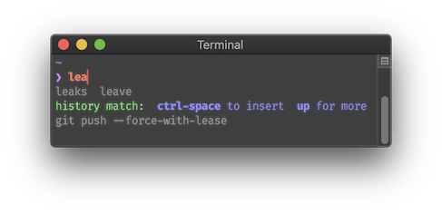
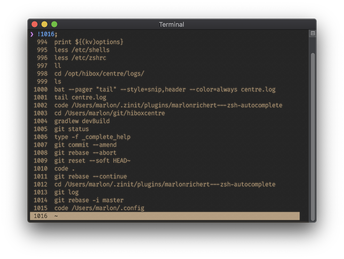
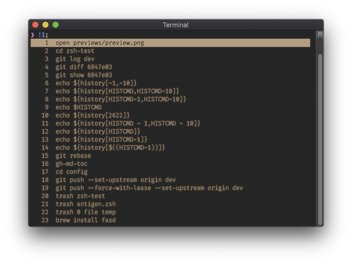
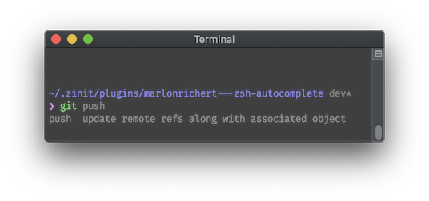
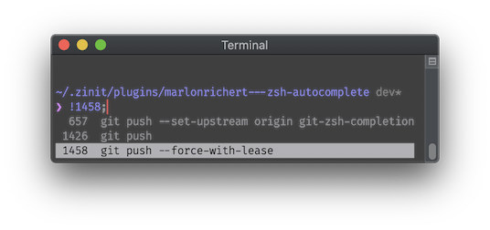
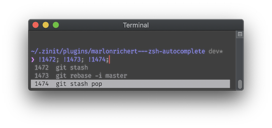
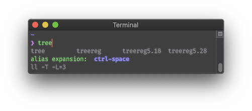

# `zsh-autocomplete`
`zsh-autocomplete` adds **real-time type-ahead autocompletion** to Zsh, plus many more completion
features.

[](https://asciinema.org/a/356653)

* [Features](#features)
* [Key Bindings](#key-bindings)
* [Requirements](#requirements)
* [Installation](#installation)
* [Settings](#settings)
* [Author](#author)
* [License](#license)

## Features

* Recent dirs completion:

  
  * Supports `cdr`, `zsh-z`, `zoxide`, `z.lua`, `rupa/z.sh`, `autojump` and `fasd`.

* Automatic incremental history search:

  

* History menu (<kbd>↑</kbd>/<kbd>PgUp</kbd>):

  |  |  |
  | --- | --- |

  * Does history search when buffer is non-empty:

    |  |  |
    | --- | --- |

* Multi-selection with <kbd>Alt</kbd>+<kbd>Space</kbd> in completion menu
  (<kbd>↓</kbd>/<kbd>PgDn</kbd>) and history menu:

  |  |  |
  | --- | --- |
  * Single selection in menus with <kbd>Enter</kbd>.

* Additional context-sensitive completions:
  * Alias expansions

    

  * Alternative quoting

    

  * Common substrings

    


## Key Bindings
| Key(s) | Action | <sub>[Widget](#advanced-choose-your-own-key-bindings)</sub> |
| --- | --- | --- |
| any | Show completions (asynchronously) | <sub>`_list_choices`</sub> |
| <kbd>Tab</kbd> | Insert top completion | <sub>`complete-word`</sub> |
| <kbd>Shift</kbd>+<kbd>Tab</kbd> | Insert bottom completion | <sub>`expand-word`</sub> |
| <kbd>Ctrl</kbd>+<kbd>Space</kbd> | Show full completion menu | <sub>`list-expand`</sub> |
| <kbd>↓</kbd> | Enter completion menu or move cursor down (in multi-line buffer) | <sub>`down-line-or-select`</sub> |
| <kbd>PgDn</kbd> | Enter completion menu (always) | <sub>`menu-select`</sub> |
| <kbd>↑</kbd> | Open history menu or move cursor up (in multi-line buffer) | <sub>`up-line-or-search`</sub> |
| <kbd>PgUp</kbd> | Open history menu (always) | <sub>`history-search`</sub> |

### Completion Menu
| Key(s) | Action |
| --- | --- |
| <kbd>↑</kbd>/<kbd>↓</kbd>/<kbd>←</kbd>/<kbd>→</kbd> | Change selection |
| <kbd>Enter</kbd> | Exit menu & execute command line |
| <kbd>Alt</kbd>+<kbd>Enter</kbd> | Exit menu |
| <kbd>Ctrl</kbd>+<kbd>Space</kbd> | Multi-select |
| <kbd>PgUp</kbd> | Page up |
| <kbd>PgDn</kbd> | Page Down |
| <kbd>Alt</kbd>+<kbd>B</kbd> | Backward one group ([if groups are shown](#show-completions-in-named-groups)) |
| <kbd>Alt</kbd>+<kbd>F</kbd> | Forward one group (if groups are shown) |
| <kbd>Home</kbd> | Beginning of line |
| <kbd>End</kbd> | End of line |
| <kbd>Alt</kbd>+<kbd>Shift</kbd>+<kbd>,</kbd> | Beginning of menu |
| <kbd>Alt</kbd>+<kbd>Shift</kbd>+<kbd>.</kbd> | End of menu |

### History Menu
| Key(s) | Action |
| --- | --- |
| <kbd>↑</kbd>/<kbd>↓</kbd> | Change selection |
| <kbd>←</kbd>/<kbd>→</kbd> | Exit menu & move cursor |
| <kbd>Enter</kbd> | Exit menu & execute command line |
| <kbd>Alt</kbd>+<kbd>Enter</kbd> | Exit menu |
| <kbd>Ctrl</kbd>+<kbd>Space</kbd> | Multi-select |
| <kbd>Alt</kbd>+<kbd>Shift</kbd>+<kbd>,</kbd> | Beginning of menu |
| <kbd>Alt</kbd>+<kbd>Shift</kbd>+<kbd>.</kbd> | End of menu |

## Requirements
Recommended:
* **[Zsh](http://zsh.sourceforge.net) 5.8** or later.

Minimum:
* Zsh 5.3 or later.


## Installation
1. `git clone` this repo.
1. Add to your `.zshrc` file:
   ```zsh
   source path/to/zsh-autocomplete.plugin.zsh
   ```

### Updating
1. `cd` into `zsh-autocomplete`'s directory.
1. Do `git pull`.

### As a Plugin
`zsh-autocomplete` should work as a plugin with most frameworks & plugin managers. Please refer to
your framework's/plugin manager's documentation for instructions.


## Settings
To change your settings, just copy-paste any of the code below to your `~/.zshrc` file.

⚠️ **Note** that while most of these settings use the `:autocomplete:` namespace, some of them use
`:completion:`. This is because the latter are managed by Zsh's own completion system, whereas the
former are unique to `zsh-autocomplete`.

* [Show more/less help text](#show-moreless-help-text)
* [Disable particular completions](#disable-particular-completions)
* [Wait for a minimum amount of input](#wait-for-a-minimum-amount-of-input)
* [Ignore certain inputs](#ignore-certain-inputs)
* [Change the "No matching completions" message](#change-the-no-matching-completions-message)
* [Use your own completion config](#use-your-own-completion-config)
* [Change <kbd>Tab</kbd> behavior](#change-tab-behavior)
* [Change other key bindings](#change-other-key-bindings)

### Show more/less help text
To show more descriptions:
```zsh
zstyle ':completion:*' extra-verbose yes
```

To show more descriptions only when you press <kbd>Ctrl</kbd>+<kbd>Space</kbd>:
```zsh
zstyle ':completion:list-expand:*' extra-verbose yes
```

To hide all descriptions:
```zsh
zstyle ':completion:*' verbose no
```

### Disable particular completions
Any of the extra completions added by `zsh-autocomplete` can be disabled through the completion
system's `tag-order` setting. For example, to disable history words, recent directories and recent
files:
```zsh
zstyle ':completion:*' tag-order '! history-words recent-directories recent-files' '-'
```

### Wait for a minimum amount of input
To suppress autocompletion until a minimum number of characters have been typed:
```zsh
zstyle ':autocomplete:*' min-input 3
```

### Ignore certain inputs
To not trigger autocompletion when the current word consists solely of two or more dots:
```zsh
zstyle ':autocomplete:*' ignored-input '..##'
```

The pattern syntax supported here is that of [Zsh's extended glob
operators](http://zsh.sourceforge.net/Doc/Release/Expansion.html#Glob-Operators).

### Change the "No matching completions" message
To alter the message shown when no matching completions can be found:
```zsh
zstyle ':autocomplete:*:no-matches-at-all' message 'No matching completions found.'
```

### Use your own completion config
To disable `zsh-autocomplete`'s pre-packaged completion config:
```zsh
zstyle ':autocomplete:*' config off
```

### Change `Tab` behavior
By default, <kbd>Tab</kbd> insert the top completion, <kbd>Shift</kbd>+<kbd>Tab</kbd> inserts the
bottom completion, and <kbd>↓</kbd> activates menu selection.

To make <kbd>Tab</kbd> first insert any common substring, before inserting full completions:
```zsh
zstyle ':autocomplete:tab:*' insert-unambiguous yes
```

To make <kbd>Tab</kbd> or <kbd>Shift</kbd>+<kbd>Tab</kbd> do menu selection:
```zsh
zstyle ':autocomplete:tab:*' widget-style menu-select
```

To make <kbd>Tab</kbd> and <kbd>Shift</kbd>+<kbd>Tab</kbd> cycle completions _without_ using menu
selection:
```zsh
zstyle ':autocomplete:tab:*' widget-style menu-complete
```

To make <kbd>Tab</kbd> try Fzf's completion before using Zsh's:
```zsh
zstyle ':autocomplete:tab:*' fzf-completion yes
```

⚠️ **Note** that, unlike most other settings, changing `widget-style` at runtime has no effect and
changing `fzf-completion` at runtime will not function correctly. These settings can be changed in
your `~/.zshrc` file only.

`widget-style`, `insert-unambiguous` and `fzf` are mutually compatible and can be used in parallel.

### Change other key bindings
Key bindings other than <kbd>Tab</kbd> or <kbd>Shift</kbd>+<kbd>Tab</kbd> can be overridden with
the `bindkey` command, if you do so _after_ sourcing `zsh-autocomplete`. To make this easier,
`zsh-autocomplete` defines an associative array `$key` that you can use:

```zsh
source path/to/zsh-autocomplete.plugin.zsh
# The following lines revert the given keys back to Zsh defaults:
bindkey $key[Up] up-line-or-history
bindkey $key[Down] down-line-or-history
bindkey $key[ControlSpace] set-mark-command
bindkey -M menuselect $key[Return] accept-line
```

## Author
© 2020 [Marlon Richert](https://github.com/marlonrichert)

## License
This project is licensed under the MIT License. See the [LICENSE](LICENSE) file for details.
