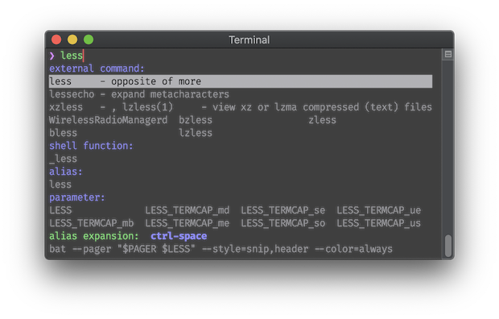

# `zsh-autocomplete`
`zsh-autocomplete` adds **real-time type-ahead autocompletion** to Zsh, plus many more completion
features.

[](https://asciinema.org/a/356653)

* [Features](#features)
* [Key Bindings](#key-bindings)
* [Requirements](#requirements)
* [Installation](#installation)
* [Settings](#settings)
* [Author](#author)
* [License](#license)

## Features

* Recent dirs completion:

  
  * Supports `cdr`, `zsh-z`, `zoxide`, `z.lua`, `rupa/z.sh`, `autojump` and `fasd`.

* Automatic incremental history search:

  

* History menu (<kbd>↑ Up Arrow</kbd> or <kbd>⇞ Page Up</kbd>):

  |  |  |
  | --- | --- |

  * Does history search when buffer is non-empty:

    |  |  |
    | --- | --- |

* Multi-selection with <kbd>⌥ Alt</kbd><kbd>␣ Space</kbd> in completion menu
  (<kbd>↓ Down Arrow</kbd> or <kbd>⇟ Page Up</kbd>) and history menu:

  |  |  |
  | --- | --- |
  * Single selection in menus with <kbd>↩︎ Return</kbd>.

* Context-sensitive completions:
  * Alias expansions

    

  * Alternative quoting

    

  * Common substrings

    

* Hidden completions can be revealed with <kbd>⌃ Control</kbd><kbd>␣ Space</kbd>.

  


## Key Bindings
| Key(s) | Action | <sub>[Widget](#advanced-choose-your-own-key-bindings)</sub> |
| --- | --- | --- |
| any | Show completions (asynchronously) | <sub>`_list_choices`</sub> |
| <kbd>⇥ Tab Right</kbd> | Insert top completion | <sub>`complete-word`</sub> |
| <kbd>⇤ Tab Left</kbd> | Insert bottom completion | <sub>`expand-word`</sub> |
| <kbd>↓ Down Arrow</kbd> | Open completion menu or move cursor down (in multi-line buffer) | <sub>`down-line-or-select`</sub> |
| <kbd>⇟ Page Down</kbd> | Open completion menu (always) | <sub>`menu-select`</sub> |
| <kbd>↑ Up Arrow</kbd> | Open history menu or move cursor up (in multi-line buffer) | <sub>`up-line-or-search`</sub> |
| <kbd>⇞ Page Up</kbd> | Open history menu (always) | <sub>`history-search`</sub> |
| <kbd>⌃ Control</kbd><kbd>␣ Space</kbd> | Reveal hidden completions and additional info | <sub>`list-expand`</sub> |

### Completion Menu
| Key(s) | Action |
| --- | --- |
| <kbd>↑</kbd>/<kbd>↓</kbd>/<kbd>←</kbd>/<kbd>→</kbd> | Change selection |
| <kbd>↩︎ Return</kbd> | Accept and exit |
| <kbd>⌥ Alt</kbd><kbd>␣ Space</kbd> | Multi-select |
| <kbd>⌃ Control</kbd><kbd>␣ Space</kbd> | Reveal hidden completions and additional info |
| <kbd>↖︎ Home</kbd> | Beginning of line |
| <kbd>↘︎ End</kbd> | End of line |
| <kbd>⇞ Page Up</kbd> | Page up |
| <kbd>⇟ Page Down</kbd> | Page down |
| <kbd>⌥ Alt</kbd><kbd>B</kbd> | Backward one group (if groups are shown) |
| <kbd>⌥ Alt</kbd><kbd>F</kbd> | Forward one group (if groups are shown) |
| <kbd>⌥ Alt</kbd><kbd><</kbd> | Beginning of menu |
| <kbd>⌥ Alt</kbd><kbd>></kbd> | End of menu |
| other | Accept selection and exit menu (then execute the key just typed) |

### History Menu
| Key(s) | Action |
| --- | --- |
| <kbd>↑ Up Arrow</kbd>/<kbd>↓ Down Arrow</kbd> | Change selection |
| <kbd>↩︎ Return</kbd> | Accept and exit menu |
| <kbd>⌥ Alt</kbd><kbd>␣ Space</kbd> | Multi-select |
| <kbd>⌥ Alt</kbd><kbd><</kbd> | Beginning of menu |
| <kbd>⌥ Alt</kbd><kbd>></kbd> | End of menu |
| other | Accept and exit menu (then execute the key just typed) |

## Requirements
Recommended:
* **[Zsh](http://zsh.sourceforge.net) 5.8** or later.

Minimum:
* Zsh 5.3 or later.


## Installation
1. `git clone` this repo. (You can optionally use a plugin manager for this.)
1. Add the following to your `.zshrc` file:
   ```zsh
   source path/to/zsh-autocomplete.plugin.zsh
   ```

### Updating
1. `cd` into `zsh-autocomplete`'s directory.
1. Do `git pull`.

(Or use your plugin manager's update mechanism).

### As a Plugin
`zsh-autocomplete` should work as a plugin with most frameworks & plugin managers. Please refer to
your framework's/plugin manager's documentation for instructions.

Note for Oh My Zsh, Prezto and Zimfw users: `zsh-autocomplete` works best if you use it
_instead_ of your framework's supplied completion module.


## Settings
The behavior of `zsh-autocomplete` can be customized through the `zstyle` system. Just copy-paste
any of the `zstyle` lines below to your `~/.zshrc` file to change your settings.

**Note** that most of the settings below use the `:autocomplete:` namespace, some of them use
`:completion:`. This is because the latter are managed by Zsh's own completion system, whereas the
former are unique to `zsh-autocomplete`.

### Show completions in named groups
Zsh's completion system has a useful feature that sorts completions into groups with informative
headers. However, by default, this is turned off.

To enable it:
```zsh
zstyle ':completion:*' group-name ''
```

### Wait for a minimum amount of input
By default, `zsh-autocomplete` will show completions as soon as you start typing.

To make it stay silent until a minimum number of characters have been typed:
```zsh
zstyle ':autocomplete:list-choices:*' min-input 3
```

### Shorten or lengthen the autocompletion list
By default, `zsh-autocomplete` limits the amount of automatically listed completions to 50% of the
available screen space to prevent the prompt from jumping around too much while you are typing.

To limit the list to a different height, use the following:
```zsh
zstyle ':autocomplete:list-choices:*' max-lines 100%
```
You can set this to a percentage or to a fixed number of lines. Both work.

### Customize the autocompletion messages
You can customize the various completion messages shown.

This is shown when the number of lines needed to display all completions exceeds the number given
by [`zstyle ':autocomplete:list-choices:*' max-lines`](
#shorten-or-lengthen-the-autocompletion-list):
```zsh
zstyle ':autocomplete:*:too-many-matches' message \
  'Too long list. Press ↓ or ⇟ to open. Type more to filter.'
```

This is shown when, for the given input, the completion system cannot find any matching completions
at all:
```zsh
zstyle ':autocomplete:*:no-matches-at-all' message 'No matching completions found.'
```

### Change Tab behavior
By default, <kbd>⇥ Tab Right</kbd> accepts the top match. The idea is that you keep typing until
the match you want is
* _at_ the top, at which point you press <kbd>⇥ Tab Right</kbd> to accept it immediately, or
* _near_ the top, at which point you press <kbd>↓ Down Arrow</kbd> or <kbd>⇟ Page Down</kbd> to
  start menu selection. Then, inside the menu, use
  * <kbd>↑</kbd><kbd>←</kbd><kbd>↓</kbd><kbd>→</kbd> to navigate the menu,
  * <kbd>↩︎ Return</kbd> to accept a single match,
  * <kbd>⌥ Alt</kbd><kbd>␣ Space</kbd> to accept multiple matches, and
  * <kbd>⌃ Control</kbd><kbd>␣ Space</kbd> to reveal hidden matches/info (which also works from the
    command line).

However, several alternative behaviors are available. The three settings for these (`widget-style`,
`insert-unambiguous` and `fzf`) can be combined.

To first insert any shared substrings, before completing entire words:
```zsh
zstyle ':autocomplete:tab:*' insert-unambiguous yes
```

To use menu selection:
```zsh
zstyle ':autocomplete:tab:*' widget-style menu-select
```

To cycle completions without using menu selection:
```zsh
zstyle ':autocomplete:tab:*' widget-style menu-complete
```

To try Fzf's completion before using Zsh's completion:
```zsh
zstyle ':autocomplete:tab:*' fzf yes
```

### Change other key bindings
`zsh-autocomplete` includes a set of intuitive [keyboard shortcuts](#key-bindings), mimicking those
offered by modern IDEs. However, you can override these with the `bindkey` command, if you do so
_after_ sourcing `zsh-autocomplete`:

```zsh
source path/to/zsh-autocomplete
# zsh-autocomplete defines an associative array `key` that you can use for this.
# The following lines revert the given keys back to Zsh defaults.
bindkey $key[Up] up-line-or-history
bindkey $key[Down] down-line-or-history
bindkey $key[ControlSpace] set-mark-command
```

### Disable particular completions
`zsh-autocomplete` adds a number of additional completions to Zsh's completion system. Any and all
of these can be disabled through the internal mechanisms of Zsh's completion system.

For example, to disable history words, recent directories and recent files:
```zsh
zstyle ':completion:*' tag-order '! history-words recent-directories recent-files' '-'
```

### Use your own completion config
`zsh-autocomplete` comes preconfigured with its own set of sophisticated completion settings, to
ensure you have the best possible out-of-the-box experience. However, some users might prefer to
build their own suite of completion settings, to fully customize the experience.

To disable the pre-packaged config:
```zsh
zstyle ':autocomplete:*' config off
```

## Author
© 2020 [Marlon Richert](https://github.com/marlonrichert)

## License
This project is licensed under the MIT License. See the
[LICENSE](/marlonrichert/zsh-autocomplete/LICENSE) file for details.
